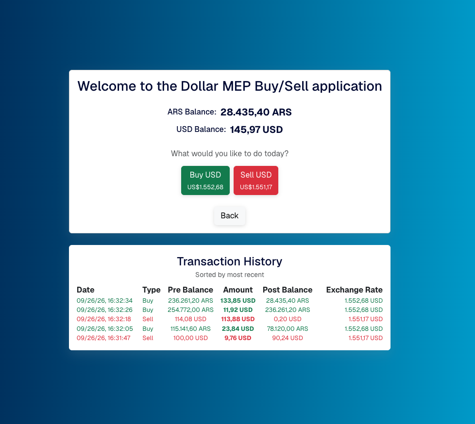
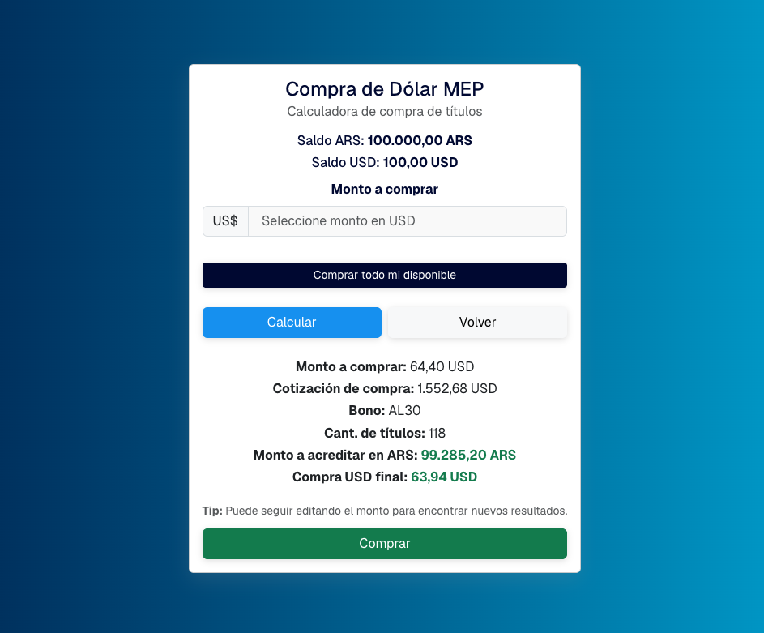
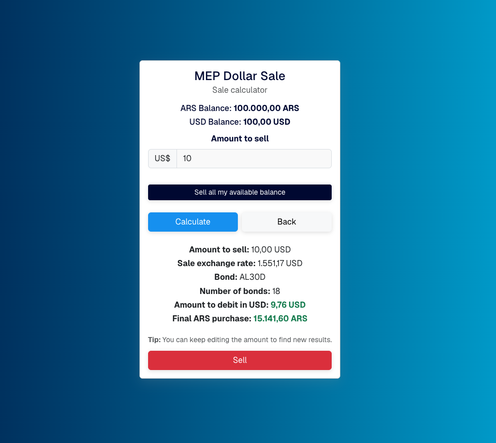

# Dollar MEP Buy/Sell Application for Latin Securities

[](https://github.com/luchob89/dolar-MEP-App-for-Latin-Securities/actions/workflows/ci.yml)
[](https://github.com/luchob89/dolar-MEP-App-for-Latin-Securities/blob/main/README.es.md)

## Screenshots

| Home | Buy | Sell |
| --- | --- | --- |
|  |  |  |

## General Description

This Dollar MEP buy/sell application is a simulation of a financial tool designed to facilitate the purchase and sale of USD using ARS through the AL30 bond. The application allows users to calculate transaction costs, execute buy/sell operations, manage their balances, and view their transaction history. \
\
It is an application built with the Next.js framework of React, which includes Redux as a state management library. I always choose Next.js whenever possible for several reasons. I already have previous experience with this framework, and I like features such as the file structure, optimizations for images and fonts, and performance improvements applied for client/server rendering and data fetching. I believe it is a framework that greatly considers the developer's perspective, and its documentation has always seemed very user-friendly to me. \
\
I used Redux, on one hand, to manage the high-level states of the application (e.g. ARS and USD user balances) and, on the other hand, as a kind of client-side database to save the transaction log and thus generate the Transaction History. Implementing a database (relational or not) seemed like it would significantly delay the development time without necessarily improving the product's functionality. Considering that the application's objective is to present it as a technical test, I solved the minimal persistent information it needs in this way. This would not be the case if the application were intended to work in a context of real, non-simulated balances.

## Link for direct access (production deployment on Vercel server)

https://dolar-mep-app-for-latin-securities.vercel.app/

## Features

- **Buy USD**: Calculate and execute the purchase of USD using ARS.
- **Sell USD**: Calculate and execute the sale of USD to obtain ARS.
- **Transaction History**: View a history of all buy and sell transactions.
- **Balance Management**: Track and update balances in ARS and USD.
- **Live AL30 bond pricing**: Buy/sell rates are calculated from a live AL30 bond quote fetched on each visit.
- **EN/ES language toggle**: Switch the whole interface between English and Spanish.

## Routes & Components

The app is built on the Next.js App Router, so each screen is a real route rather than client-side state toggling within a single page.

### `/` — `app/page.tsx`

Landing route. Renders `ChooseAmounts` (`app/chooseAmounts.tsx`), which lets users enter initial balance amounts in ARS and USD for a simulation closer to their own numbers, or continue with the app's default balances. Inputs are validated (must be > 0 and ≤ 100,000,000). If one or more transactions have already been made, this screen also shows a button to clear the Transaction History.

### `/mainCard` — `app/mainCard/page.tsx`

Main hub. Displays current ARS/USD balances and buttons to go to the buy or sell flow, each annotated with the live buy/sell rate. Once one or more transactions exist, it renders `TxsHistoryTable` (`app/mainCard/TxsHistoryTable.tsx`) below, showing more columns on desktop than on mobile.

### `/mainCard/buy` — `app/mainCard/buy/page.tsx`

Lets the user enter the ARS amount to spend buying USD (or use "Buy all my available balance" to compute the max automatically), with validation and error handling. On calculating, it renders `BuyCalculationResult` (`app/mainCard/buy/BuyCalculationResult.tsx`), which shows the buy quote, bond ticker, number of bonds, ARS to debit and final USD credited, and drives the confirm/success modals for the transaction.

### `/mainCard/sell` — `app/mainCard/sell/page.tsx`

The sell-side mirror of the above: enter (or auto-fill) the USD amount to sell, then `SellCalculationResult` (`app/mainCard/sell/SellCalculationResult.tsx`) shows the sell quote and drives the confirm/success modals.

## State Management

Redux (via Redux Toolkit) manages balances, transaction history, and the selected language. The store (`lib/store.ts`) and its single slice, `userDataSlice` (`lib/userDataSlice.ts`), are provided once at the root layout (`app/layout.tsx`) via `lib/CustomReduxProvider.tsx`, so every route shares the same state. AL30 bond pricing is fetched separately with a small SWR hook (`features/getAL30Data.ts`) rather than through Redux, since it's remote, cached data rather than user state.

## Testing

The app has unit/integration tests for every screen and calculation component using Jest and React Testing Library (`npm test`, 46 tests across 7 suites). They cover rendering, input validation, navigation, error states, and the buy/sell confirmation flow, with a fresh preloaded Redux store per test.

A [GitHub Actions workflow](.github/workflows/ci.yml) runs lint, typecheck, tests, and the build on every push and pull request to `main`.

## Scripts

| Script | What it does |
| --- | --- |
| `npm run dev` | Start the local dev server (Turbopack) |
| `npm run build` | Production build |
| `npm start` | Build and run the production server |
| `npm run lint` | ESLint via `next lint` |
| `npm run typecheck` | TypeScript check with no emit |
| `npm test` | Run the Jest test suite |
| `npm run verify` | Run lint, typecheck, and tests together |

## Installation

To install and run the application locally, follow these steps:

1. Clone the repository:

    ```
    git clone https://github.com/luchob89/dolar-MEP-App-for-Latin-Securities
    ```

2. Navigate to the project directory:

    ```
    cd dolar-MEP-App-for-Latin-Securities
    ```

3. Install dependencies:

    ```
    npm install
    ```

4. Run it locally in development mode:

    ```
    npm run dev
    ```

   Or build and start a production version:

    ```
    npm start
    ```

### Running with Docker

A `Dockerfile` is included (multi-stage build, standalone Next.js output):

```
docker build -t dolar-mep-app .
docker run -p 3000:3000 dolar-mep-app
```

## Usage

1. Open the application in your browser.
2. Enter an ARS balance to use for buying USD and a USD balance to use for obtaining ARS. You can also continue with the application's default balances.
3. Click the "Buy USD" button to buy USD or the "Sell USD" button to sell USD.
4. Confirm the transaction in the modal that appears.
5. View the updated balances and transaction history.

## What I'd change for production

This app was built as a technical test, so a few shortcuts make sense to call out explicitly:

- **Real persistence**: balances and transaction history live only in the Redux store (`lib/userDataSlice.ts`), so they reset on every page reload and aren't shared across devices. A real product needs a database instead.
- **Authentication**: there's no login or user identity — anyone who opens the app gets the same default balances. Production would need real auth tied to actual accounts.
- **Audit logging**: transactions are recorded client-side only for display purposes, not persisted or auditable server-side, which a financial tool would need.
- **Error monitoring**: `app/error.tsx` catches render errors and logs them to the console; a production app would send them to a monitoring service (e.g. Sentry).
- **Server-side quote validation**: the AL30 quote is fetched client-side from a third-party endpoint (`features/getAL30Data.ts`) with no server-side check before a transaction is confirmed.
